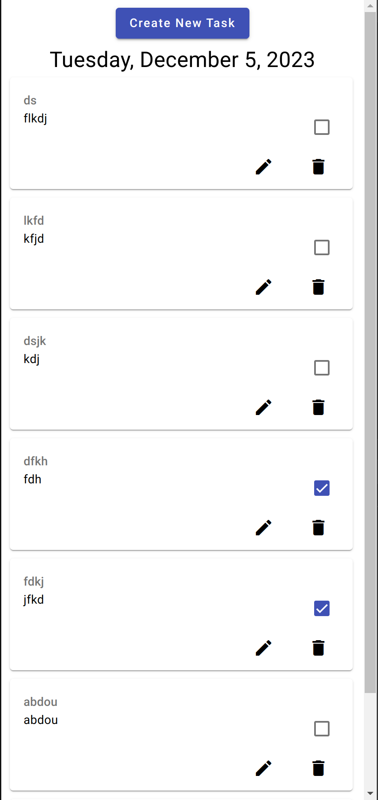

# Angular Todo List App

A Todo List mobile friendly web application built with Angular.



## Description

This project is a web application (mobile friendly) that allows users to manage their tasks through a simple interface. Users can add, remove, edit, and mark tasks as completed.

## Features

- Add tasks with username and todo text
- Mark tasks as completed
- Edit existing tasks
- Remove tasks

## Framework and Tools

- **Angular**: Version 17.0.0
- **Node.js**: Version 18.13.0
- **Angular CLI**: Version 17.0.5
- **RxJS**: Version 7.8.0
- **Typescript**: Version 5.2.2
- **EsLint**: Version 8.54.0
- **Prettier**: Version 3.1.0
- **Jasmine**: Version 5.1.0

## Installation

### Prerequisites

- Node.js installed (https://nodejs.org)
- Angular CLI (installed globally): `npm install -g @angular/cli`

### Steps

1. Clone the repository:

   ```bash
   git clone https://github.com/abderrahmenDeveloper/todo-list.git
   ```

2. Navigate to the project directory:

   ```bash
   cd angular-todo-list
   ```

3. Install dependencies:

   ```bash
   npm install
   ```

### Usage

1. Start the development server:

   ```bash
   ng serve
   ```

2. Open a web browser and navigate to:
   ```bash
   http://localhost:4200/
   ```

### Tests

1. Run tests:
   ```bash
   ng test
   ```
